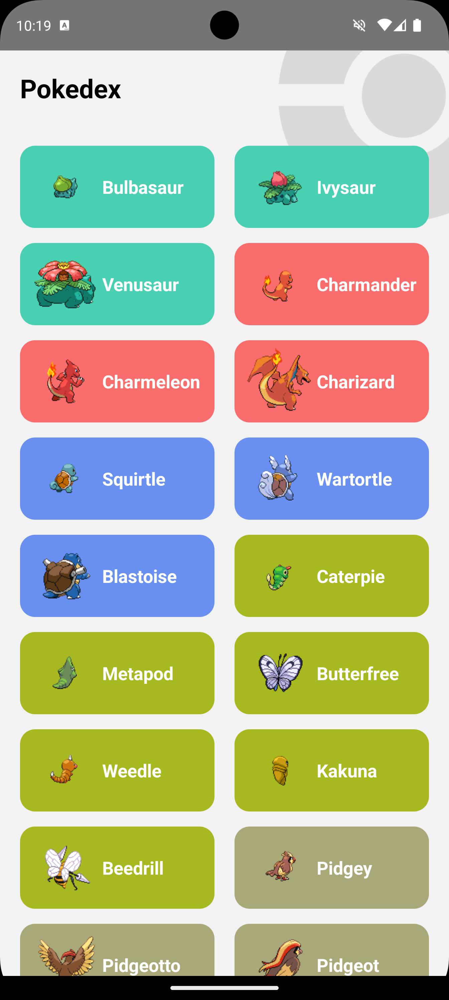

# FidMe React Native challenge

This small exercice is just meant to challenge new FidMe appliants.

### Get started !

-   Clone this repo (do **not** fork it)
-   Install react native & ruby if you haven't (any version will do fine, just edit the .ruby-version file with the proper version)
-   Run `yarn up && yarn android`

### The challenge

The goal of this exercise is to create a pokédex. The test will take place in two steps.

You will first try to reproduce the following screen :

Then you will add a second screen that will allow you to view the details of a pokemon (no need to go into detail, a navigation to this screen and the display of the image of the pokemon and its name will suffice)

You will find all the information needed to retrieve the data here: https://pokeapi.co/.

Feel free to take liberties with the libraries used, the designs, etc.

Good luck !

### What we expect from you

-   Take your time :)
-   Produce what your consider to be clean code.
-   Use simple and clean components
-   Do not try to overthink it
-   You can create files and folders if you want as well as use external libraries.
